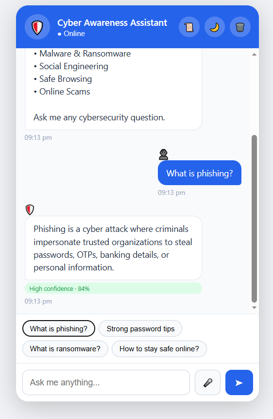
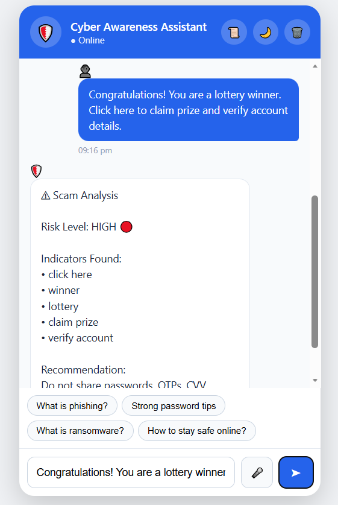
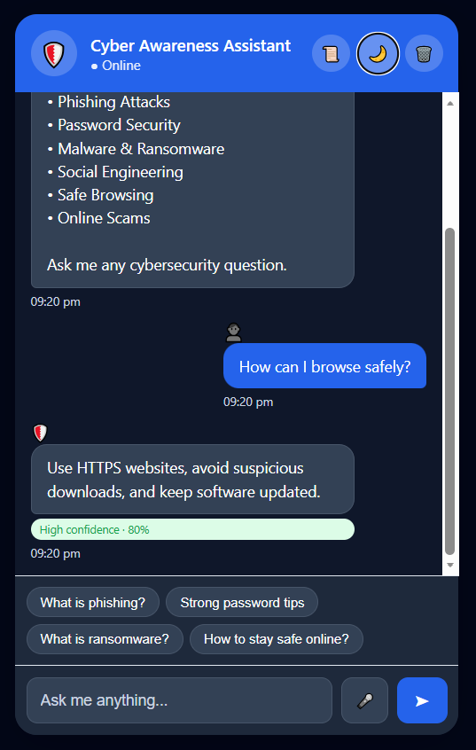
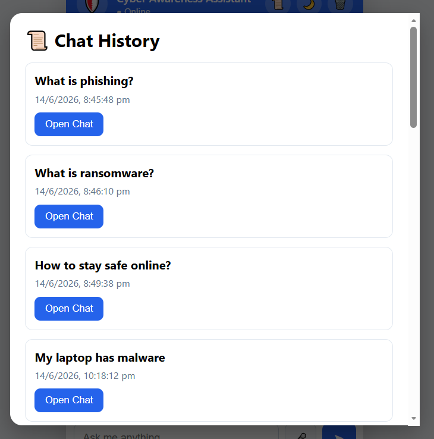

# CodeAlpha Cyber Awareness FAQ Chatbot

An AI-powered cybersecurity awareness chatbot developed for the CodeAlpha Artificial Intelligence Internship.

## Features

* Cybersecurity FAQ Chatbot
* Semantic Search
* Cosine Similarity Matching
* Voice Input Support
* Text-to-Speech Responses
* Scam Detection
* Incident Response Guidance
* Chat History Storage
* Dark Mode Support
* Responsive User Interface

## Technologies Used

* HTML5
* CSS3
* JavaScript
* Transformers.js
* Xenova/all-MiniLM-L6-v2
* Natural Language Processing (NLP)
* Semantic Search
* Cosine Similarity
* Web Speech API
* Local Storage

## How It Works

1. Users ask cybersecurity-related questions.
2. The chatbot processes the query using NLP techniques.
3. Semantic search compares the query with the cybersecurity knowledge base.
4. Cosine similarity identifies the most relevant answer.
5. The chatbot displays the best matching response.
6. Scam-related messages are analyzed and flagged when detected.
7. Users can interact using voice input and listen to responses through text-to-speech.

## Project Objective

To develop an intelligent cybersecurity awareness chatbot capable of answering user queries, detecting scams, providing incident response guidance, and promoting safe online practices using NLP and semantic search techniques.

## Internship

CodeAlpha Artificial Intelligence Internship

## 🔗 Live Demo

https://harika-706.github.io/codealpha_tasks/Task2_FAQChatbot/

## Screenshots

<h2>Screenshots</h2>

  
  

  
  

  

